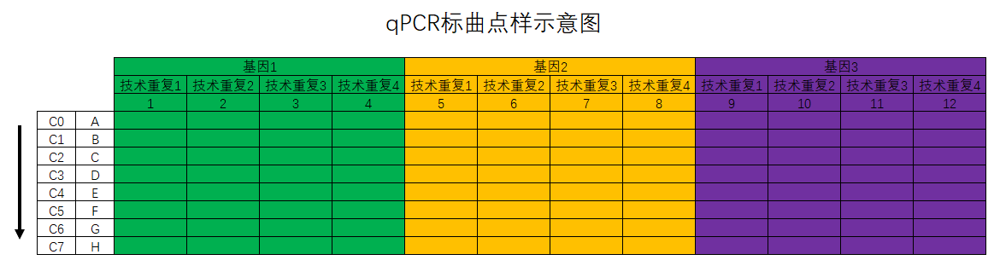
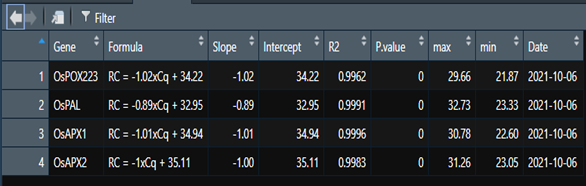
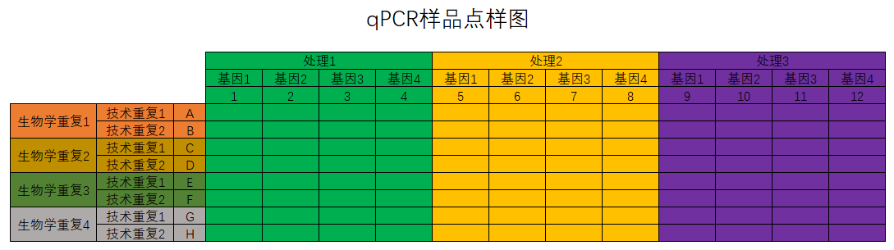

# 生物信息学 {#bioinf}


## 本章前言

本章主要是关于生物信息学的相关知识。

## `WSL`安装使用`Docker`

### `Docker`的安装
参考的安装教程：[Docker-从入门到实践](https://yeasy.gitbook.io/docker_practice/install/ubuntu)。关键的代码如下：
```r
curl -fsSL test.docker.com -o get-docker.sh
curl -fsSL get.docker.com -o get-docker.sh
sudo sh get-docker.sh --mirror Aliyun
sudo sh get-docker.sh --mirror AzureChinaCloud
```

### `Docker`的使用
`Docker`默认是需要`root`用户才能使用的，在`Windows上`我习惯于进入`Powershell`后执行下面的命令启动`Docker`：
```shell
wsl --shutdown # 先关闭wsl
wsl # 启动WSL
sudo su # 进入root
sudo service docker start # 启动Docker
su xiang # 切换会用户（非root权限）
```

### 如何从`WSL1`切换到`WSL2`
我在`Windows`上使用`Docker`遇到的一个很奇怪的问题是，我之前的版本是`WSL1`,`Docker`无论如何都无法使用，搜索半天也没有找到解决方法，索性将`WSL1`升级成`WSL2`，没想到问题就那样解决了。参考教程：[知乎：WSL1 升级为WSL2](https://zhuanlan.zhihu.com/p/356397851)。下面是升级的过程：

- 下载对应的内核更新包：[点击下载](https://link.zhihu.com/?target=https%3A//wslstorestorage.blob.core.windows.net/wslblob/wsl_update_x64.msi)

- `CMD`中管理员身份运行代码：
  ```shell
  dism.exe /online /enable-feature /featurename:VirtualMachinePlatform /all /norestart
  ```

- 设置版本
  ```shell
  wsl --set-version Ubuntu-20.04 2
  ```
  其中的`Ubuntu-20.04`是通过代码`wsl -l -v`查看到的。
  
  然后再次重启`WSL`即可。

### 下载`Docker`镜像
在[Docker Hub](https://hub.docker.com/)中检索下载需要的镜像。

### `Docker`的使用
进入`WSL`后运行下方代码运行`Docker`：
```shell
docker run -v /mnt/:/work -it omicsclass/rnaseq
```
其中的`work`是不一定的，需要看镜像给的路径是啥。

### 如何创建自己的镜像
先从[Docker Hub](https://hub.docker.com/)下载`Ubuntu`的官方镜像，然后在镜像中安装需要的软件。
PS：如何加速`pip`的下载：
```shell
pip install django -i https://pypi.tuna.tsinghua.edu.cn/simple
```

加速的`R`包的下载安装：
```r
options(repos=structure(c(CRAN="https://mirrors.tuna.tsinghua.edu.cn/CRAN/")))
options(BioC_mirror="https://mirrors.tuna.tsinghua.edu.cn/bioconductor")
```

在安装完成需要的软件后，先运行`exit`退出`Docker`，然后运行下面的代码生成新的镜像：
```shell
docker commit -m " add some softwares for RNA-Seq" -a "xiangli" 21bfa810c811 lixiang117423/rnaseq:v1
```

然后登陆自己的`Docker`，登录以后把新的镜像推送到`Docker Hub`即可：
```shell
docker push lixiang117423/rnaseq:v1
```

## `Conda`的安装使用

### 下载安装
现在[官方网站](https://docs.conda.io/projects/conda/en/latest/user-guide/install/download.html)下载对应版本的`.sh`文件。然后一路默认安装即可。安装完成后激活用户目录下的`.bashrc`文件即可。

### `Conda`安装`R`及`R`包
```shell
conda instll r-base
conda instll r-ggplot2
conda install -c bioconda bioconductor-deseq2
```

### 安装其他软件
其他软件的安装直接去[Conda Gallery](https://anaconda.org/gallery)上检索进行安装。

### `pip`下载速度慢的解决方法：
```shell
pip install django -i https://pypi.tuna.tsinghua.edu.cn/simple
```


## R包pac4xiang的使用

`pac4xiang`这个R包是我自己开发的，包含了一些我自己常用的函数。包目前在[GitHub](https://github.com/lixiang117423/pac4xiang)上，更多功能还在完善中，待进一步开发。

### 安装
在R中运行下面的代码安装`pac4xiang`。
```R
devtools::install_github('https://github.com/lixiang117423/pac4xiang')
```
### 使用方法
- `calStandCurve`
  该函数用与计算相对定量qPCR的标曲。qPCR标曲点样参照图\@ref(fig:qPCR1)。按照我的思路和习惯，我会准备8个浓度梯度的cDNA,从高到低分别是C0到C8。C0是对应批次下多有样品cDNA的组合，然后再以一定的稀释倍数稀释得到C1，C1再以同样的倍数稀释得到C2，依此类推，直到得到C8。
  
<div class="figure" style="text-align: center">

<p class="caption">(\#fig:qPCR1)qPCR标曲点样示意图</p>
</div>
函数具体怎么用呢？参考下方的代码：


```r
df.1 <- calStandCurve(
  data = "20210927下机数据/20210928lx_1.txt", # 下机数据位置
  genes = c("OsPOX223", "OsAPX1", "OsAPX2", "OsPAL"),# 基因名称,与点样表顺序对应
  rep = 3, # 技术重复的数量
  dilution = 4, # 稀释倍数
  start = 2, # 从第几行开始计算
  end = 6, # 到第几行终止计算
  drop.NA = TRUE, # 是否剔除空值
  fig.type = "pdf" # 保存的图片的文件格式
)
```
其中基因的数量和技术重复的数量乘起来必须是12；基因的顺序必须是从左到右的；输入稀释倍数后告诉程序后续的标曲建立如何取相应的对数；`start`表示从第几行开始计算，如`start = 2`表示的是从B行开始计算标曲；对应的`end = 6`表示的是到第6行，也就是F行结束，也就意味着第一行和最后两行其实是不用的。默认是保存标曲的图片的，如果不需要保存图片加上`save.fig = FALSE`即可，默认的图片格式是`pdf`格式，可以自定义。

<div class="figure" style="text-align: center">

<p class="caption">(\#fig:qPCR2)函数calStandCurve返回的数据框</p>
</div>
返回的结果是个数据框（参考图\@ref(fig:qPCR2)），包含了基因名称、标曲公式、斜率、截距、R$^2$、P值、该标曲适用的自变量范围（最大值和最小值）及计算标曲的日期等。保存的图片默认存在当前工作目录下（运行`getcwd()`查看当前R语言工作目录）。


- `calRTqPCR`
  该函数在`calStandCurve`函数返回的标曲结果的基础上可以计算不同处理下各基因的表达情况。样品的点样方法参考图\@ref(fig:qPCR3)。
  
<div class="figure" style="text-align: center">

<p class="caption">(\#fig:qPCR3)qPCR标曲点样示意图</p>
</div>
计算表达量的代码如下：

```r
exp.1 <- calRTqPCR(
  data = "20210927下机数据/20210929lx_1.txt",# 下机数据位置
  StandCurve = df.1,#标曲对应的数据框，上一步的输出结果
  genes = c("OsPOX223", "OsAPX1", "OsAPX2", "OsPAL"),# 基因名称,与点样表顺序对应
  treatment = c("CK", "Inter", "Infect") # 三个不同的处理分别是什么
)
```

  其中的`data`就的样品的下机导出数据，`StandCurve`是函数`calStandCurve`返回的数据框，`gene`需要严格控制大小写，必须和输入函数`calStandCurve`的基因名称一样，`treatment`是指定从左到右的处理分别是什么，这个是为了后续方便进行*`t`*检验。

- `getAlignResults`
  该函数可以将软件`CLUSTALW`的输出文件变成`.fasta`格式的比对结果。
  写这个函数的原因在于每次我用MEGA进行序列比对构建进化树的时候都报错，不是字符串有问题就是长度不对，索性直接用Linux系统下的`CLUSTALW`进行序列比对，然后用MEGA构建进化树，百试不爽！

```r
my.aln = getAlignResults(aln = 'test.aln')
```
  运行完成后会在当前目录下生成一个`YourAlignResults.fasta`文件，就是`fasta`格式的比对文件，然后就可以用来构建进化树了。
- `mult.aov`
  该函数用于多分组数据进行方差分析。

- `multGroupTtest`
  该函数用于进行多分组的`t`检验。
  这个函数是用于进行多组`t`检验的。比如每次跑qPCR，会有多个处理多个目的基因，这个时候就需要关注每个目的基因在不同的处理中的表达量。用法参考下方代码：

```r
t.test <- multGroupTtest(
  data = exp.all.final, # 输入矩阵
  group1 = "Gene", # 第一个分组名称
  group2 = "Treatment", # 第二个分组名称
  CK = "CK", # 指定CK是叫什么
  value = "Expression", # 指定用于比较的数值在哪一列
  level = 0.95 # 指定检验水平
)
```

- `plot96well`
  该函数用于可视化`Roche`96孔板的`Cq`值。

```r
plot96well(data = "20210927下机数据/20210928lx_1.txt")
```

- `plotCisElement`
  该函数用与可视化基因启动子上的顺式作用元件。需要输入的参数有三个：
  - `data`：`plantCARE`返回的文件；
  - `length`：启动子长度；
  - `Cis`：需要展示哪些顺式作用元件。

- `plotGeneStructure`
  该函数用于可视化基因结构。输入文件为`.gtf`文件。
  如果同时输入对应的进化树文件，那么就会按照进化树的顺序对基因名称进行排序，可以和`ggtree`进行联用。


  
  
  
  
  
  
  
