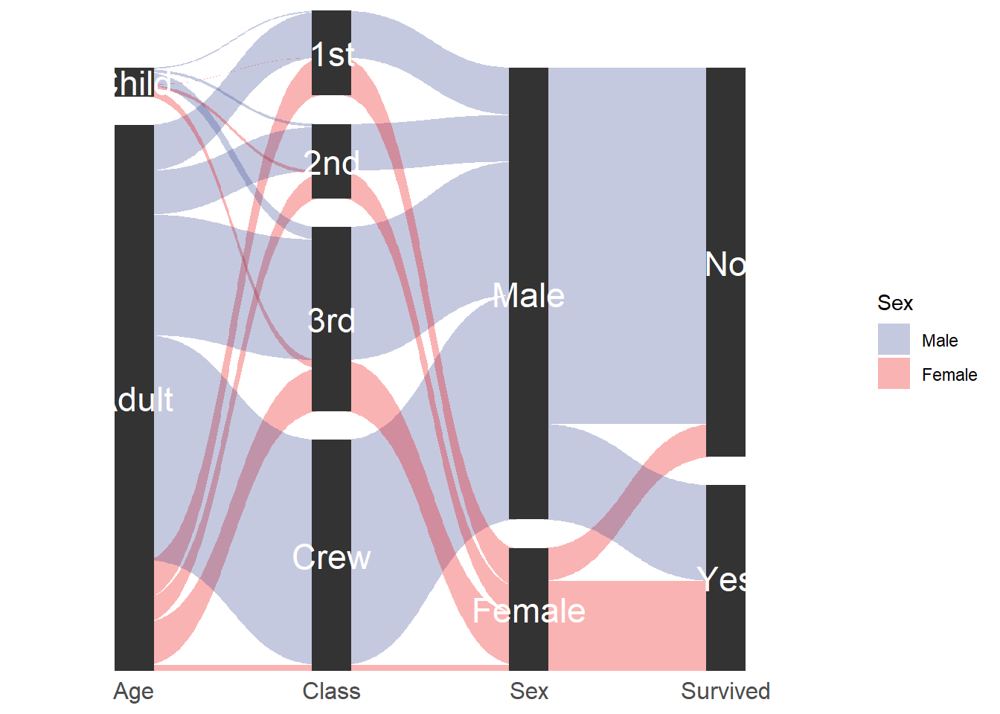

# 数据可视化 {#r-vis}

## `ggplot2`绘图相关

### `ggplot2`绘制桑基(冲击图)


```r
library(ggforce)
titanic <- reshape2::melt(Titanic)
# This is how we usually envision data for parallel sets
#head(titanic)
# Reshape for putting the first 4 columns as axes in the plot
titanic <- gather_set_data(titanic, 1:4)
#head(titanic)
# Do the plotting
ggplot(titanic, aes(x, id = id, split = y, value = value)) +
  geom_parallel_sets(aes(fill = Sex), alpha = 0.3, axis.width = 0.1) +
  geom_parallel_sets_axes(axis.width = 0.2) +
  geom_parallel_sets_labels(colour = 'white',angle = 0, size = 6) +
  scale_y_continuous(expand = c(0,0)) +
  scale_fill_aaas() +
  theme_minimal() +
  theme(axis.text.y = element_blank(),
        axis.text.x = element_text(size = 12),
        axis.title = element_blank(),
        panel.background = element_blank(),
        panel.grid = element_blank())
```

<div class="figure" style="text-align: center">

<p class="caption">(\#fig:ggplot4SankeyDiagram)ggplot2绘制桑基图示例</p>
</div>

